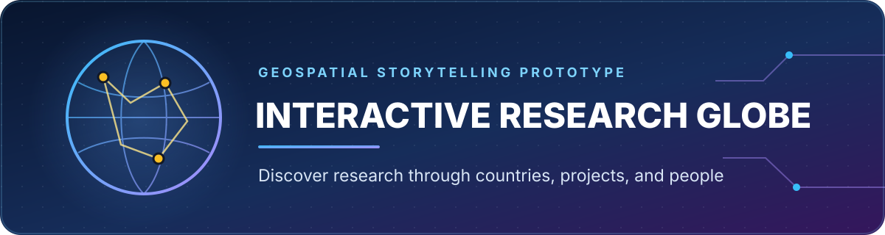

<p align="center">
  
</p>

<p align="center">
  A focused React prototype for presenting international research through an interactive, rotating globe.
</p>

<p align="center">
  
  
  
  
  
</p>

## Overview

**Interactive Research Globe** is a geospatial storytelling interface that maps research projects to countries and cities around the world. The application uses an animated orthographic map to create a globe-like experience: visitors can rotate the world, select highlighted countries, zoom to a region, and explore the related project content in a rich modal gallery.

This repository represents a streamlined prototype focused on the core globe and country-project interaction.

## Key Features

- 🌐 Animated orthographic world map with continuous rotation
- 📌 Pulsing point markers based on latitude and longitude
- 🎨 Distinct map states for available, hovered, and selected countries
- 🔍 Country-level zoom and a home control for resetting the view
- 🗂️ Country-to-project dataset with descriptions and researcher details
- 🎞️ Image carousel and embedded video support
- ☁️ Firebase Hosting configuration included

## Tech Stack

| Purpose | Technologies |
|---|---|
| Front end | React 18, Create React App |
| Visualisation | amCharts 5, amCharts Geodata |
| UI | Chakra UI, Emotion, Framer Motion |
| Project media | Swiper, ReactPlayer |
| Services | Firebase, Axios |

## Project Structure

```text
src/
├── assets/                  # Branding and project images
├── components/
│   └── ModalShowProject/    # Project detail gallery
├── data/
│   ├── cities.js            # Geographic marker coordinates
│   ├── country.js           # Research projects grouped by country
│   └── image_videosExport.js
├── page/HomePage.jsx        # Globe setup and user interaction
├── App.js
└── index.js
```

## Getting Started

### Prerequisites

- Node.js 16 or later
- npm or Yarn

### Run Locally

```bash
git clone https://github.com/salmasoo88/globe2.git
cd globe2
npm install
npm start
```

The development server opens at [http://localhost:3000](http://localhost:3000).

## Available Scripts

| Command | Description |
|---|---|
| `npm start` | Run the development server |
| `npm test` | Start the interactive test runner |
| `npm run build` | Generate a production bundle |
| `npm run eject` | Expose the underlying CRA configuration |

## Adding Research Content

1. Add project imagery to `src/assets/images/Project_images/`.
2. Export the asset from `src/data/image_videosExport.js`.
3. Add the country and project record to `src/data/country.js`.
4. Add or update map coordinates in `src/data/cities.js`.

Each project entry can provide a title, location, principal investigator, description, image, and video.

> [!IMPORTANT]
> This is an archived prototype snapshot. Some project records reference local video files that are not included in the repository, and an experimental on-page control remains unfinished. Restore or remove those references before creating a production build.

## Contribution Guide

The most valuable improvements for this prototype are:

- removing unfinished interface controls and unused imports;
- adding graceful fallbacks for missing project media;
- improving map accessibility and responsive behaviour; and
- aligning the Firebase Hosting directory with the generated React build output.

Please keep each change focused and confirm that country selection, globe rotation, and project modals still work as expected.

## Deployment

A Firebase Hosting configuration is provided in `firebase.json`. Confirm that its `public` directory matches the generated React build directory before deployment.

## Maintainer

**Salma Soofiyan** — Cybersecurity, AI & Machine Learning Researcher<br>
[GitHub](https://github.com/salmasoo88) · [LinkedIn](https://www.linkedin.com/in/salma-soofiyan-92033011b/)
